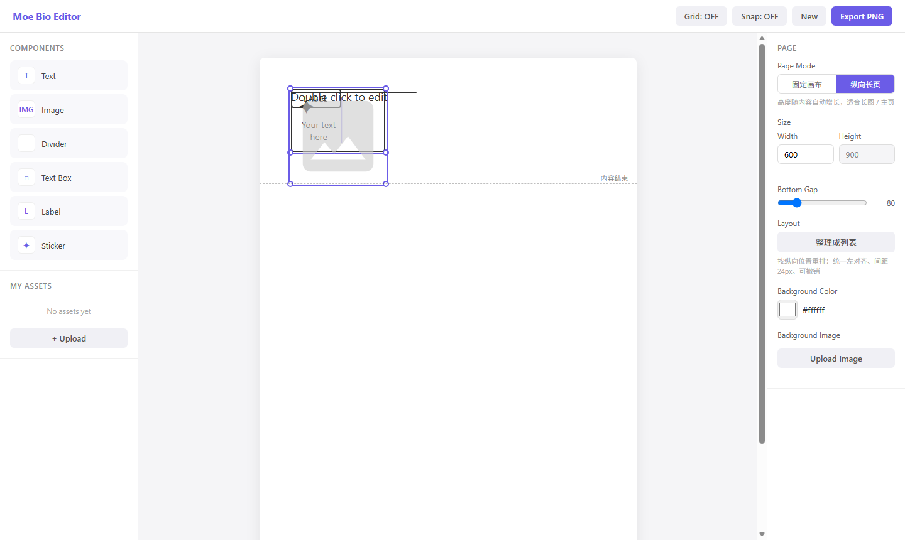

# moeEditer

轻量的 Rentry Bio / Tumblr 风格自由布局长图编辑器。纯原生 HTML / CSS / JavaScript，
**零依赖**：没有框架、没有构建链、没有后端、没有登录，一切都在本地浏览器里完成。



## 特性

- **自由布局画布**：拖拽 / 缩放 / 旋转层级，元素类型含文本、图片、贴纸、分隔线、标签、Box
- **图片裁剪模式**：框内平移定位、四角改框、预设形状（圆形 / 心形 / 星形等），
  裁剪几何按比例存储，拉伸元素时图片自动跟随
- **Box 分栏**：单栏 / 左右 / 上下，每栏独立标题、正文与对齐
- **页面两种模式**：固定尺寸（预设比例）/ 纵向长页（高度跟随内容，拖到视口边缘自动滚动）
- **所见即所得导出**：导出 PNG 与画布逐像素对齐（阴影、内外边框、形状裁剪、折行、字距）
- **窄屏适配**：手机上侧栏收成抽屉、画布等比缩放、真实触摸手势验证过
- **撤销 / 重做**：50 步历史，整理成列表等批量操作也是一步撤销

## 使用

最简单的方式 —— 用浏览器直接打开单文件版：

```
dist/moe-bio-editor.html
```

或者跑开发形态 `src/index.html`（需要通过本地服务器打开，例如
`python -m http.server`；直接双击 file:// 也可用，但素材 localStorage 与单文件版隔离）。

作品自动保存在浏览器 localStorage，没有云端。

## 开发

```
src/      源码（index.html 按 <script> 顺序加载 18 个 js，无模块系统）
tools/    工具链（Node 内置能力即可，无需 npm install）
dist/     单文件构建产物（由工具生成，不要手改）
```

常用命令：

```bash
node tools/run-probes.js        # 全量回归探针（9 个探针，249 条断言）
node tools/build-single.js      # 重建单文件产物 → dist/
node tools/probe-single.js      # 验证 dist/ 产物（14 项）
node tools/make-probe.js <源.js> <输出.html>   # 从 src/index.html 生成探针页
node tools/probe-device.js <探针.html> 390 844 截图.png   # 真机尺寸跑探针
node tools/probe-touch.js <探针.html> 390 844 截图.png    # 真实触摸事件跑探针
```

> 触摸类问题（拖不动 / 手势被抢）必须用 `probe-touch.js` 测 —— 合成
> `PointerEvent` 绕过浏览器手势仲裁，这类 bug 在合成事件下永远不会复现。

## 文档

| 文档 | 内容 |
|---|---|
| [prd.md](prd.md) | 产品需求 |
| [ARCHITECTURE.md](ARCHITECTURE.md) | 架构、模块职责、约束与验证方法论（最全的一份） |
| [PLAN.md](PLAN.md) | 迭代计划与方案记录 |
| [TODO.md](TODO.md) | 各 Phase 的实施记录与验收清单 |

## License

MIT
